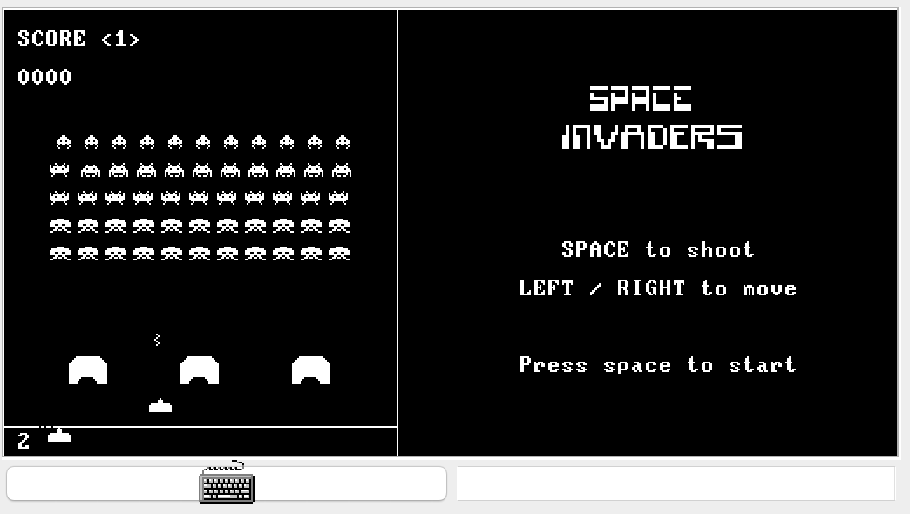

# Space Invaders in Jack

A clone of the original arcade version of Space Invaders written in the Jack programming language. I completed this project as part of the "Elements of Computing Systems" (aka Nand to Tetris). This game duplicates many features of the original game including:

* Player and alien missles.
* Shields to protect the player.
* Scoring and multiple levels.
* Custom white sprites that can appear anywhere on the screen.

[Longer Demo on YouTube](https://www.youtube.com/watch?v=jKqC16h59aE)

